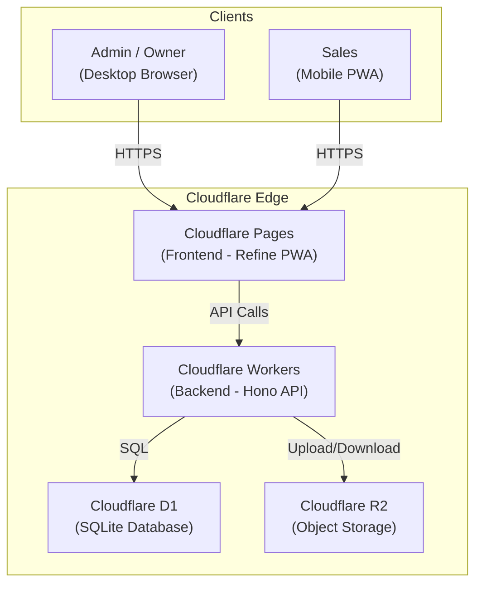
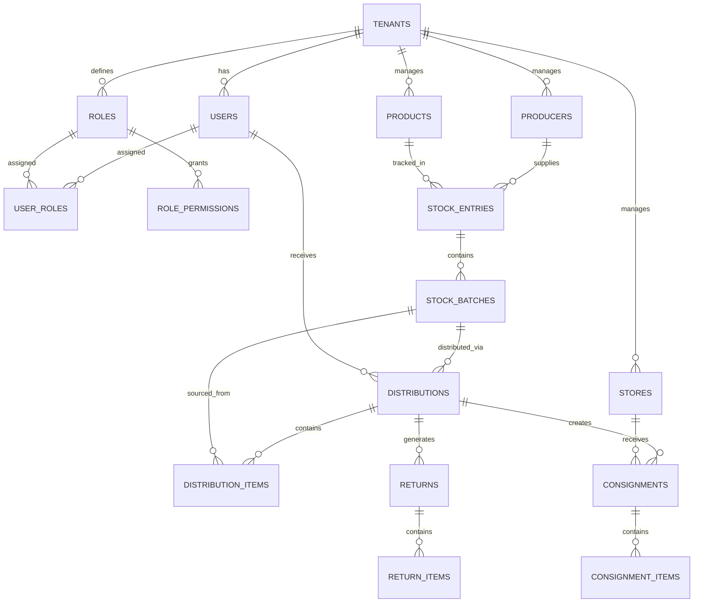

# SaaS Manajemen Penjualan — Sistem Konsinyasi

Aplikasi SaaS untuk manajemen penjualan dengan sistem konsinyasi, dibangun dengan arsitektur modern (Refine + Hono + Cloudflare). Mendukung multi-tenant, RBAC dinamis, dan PWA untuk tim lapangan (Sales).

---

## User Review Required

> [!IMPORTANT]
> **Proyek ini sangat besar.** Rencana ini dibagi menjadi 5 tahapan (sesuai permintaan). Tahap 1 dan 2 akan dibangun terlebih dahulu secara penuh. Tahap 3–5 (deploy ke Cloudflare) memerlukan akun Cloudflare yang sudah dikonfigurasi dan akan menjadi tahap terpisah setelah foundation selesai.

> [!WARNING]
> **Cloudflare Account Required.** Untuk Tahap 3–5, Anda harus memiliki akun Cloudflare dan `wrangler` CLI yang sudah ter-autentikasi (`wrangler login`). Database D1 dan R2 Bucket perlu dibuat manual via dashboard atau CLI sebelum deploy.

---

## Open Questions

> [!IMPORTANT]
> **1. Nama Aplikasi / Brand:** Apa nama resmi aplikasi ini? Saat ini akan menggunakan **"KonsinyasiApp"** sebagai placeholder.

> [!IMPORTANT]
> **2. Bahasa UI:** Apakah seluruh antarmuka dalam **Bahasa Indonesia** atau **Bahasa Inggris**? Rencana ini mengasumsikan **Bahasa Indonesia** untuk semua label, menu, dan form.

> [!IMPORTANT]
> **3. UI Framework pada Refine:** Pilihan yang tersedia:
> - **Ant Design** (Paling mature, komponen lengkap untuk admin panel — *direkomendasikan*)
> - **Material UI**
> - **Mantine**
> - **Headless** (Custom styling manual)
>
> Rencana ini mengasumsikan **Ant Design** karena sangat cocok untuk aplikasi admin/SaaS B2B.

> [!IMPORTANT]
> **4. Multi-tenant isolation:** Apakah setiap unit usaha (tenant) akan memiliki database D1 terpisah, atau cukup isolasi di level row (tenant_id column)? Rencana ini mengasumsikan **row-level isolation** (single database, `tenant_id` di setiap tabel).

---

## Arsitektur Sistem



### Monorepo Structure (Turborepo)

```
distribusikonsinyasi/
├── apps/
│   ├── web/                    # Frontend (Refine + Ant Design + Vite)
│   │   ├── src/
│   │   │   ├── components/     # Shared UI components
│   │   │   ├── pages/          # Page components per resource
│   │   │   ├── providers/      # Auth, Data, AccessControl providers
│   │   │   ├── hooks/          # Custom hooks
│   │   │   ├── utils/          # Helpers & formatters
│   │   │   ├── styles/         # Global CSS & theme
│   │   │   └── App.tsx         # Root app with Refine config
│   │   ├── public/             # PWA assets (manifest, icons, SW)
│   │   ├── vite.config.ts
│   │   └── package.json
│   │
│   └── api/                    # Backend (Hono + Cloudflare Workers)
│       ├── src/
│       │   ├── routes/         # API route handlers
│       │   ├── middleware/     # Auth, RBAC, validation middleware
│       │   ├── db/             # Drizzle schema & migrations
│       │   ├── services/       # Business logic layer
│       │   ├── storage/        # R2 storage helpers
│       │   └── index.ts        # Hono app entry point
│       ├── drizzle/            # Generated migration SQL files
│       ├── wrangler.jsonc
│       └── package.json
│
├── packages/
│   ├── shared/                 # Shared types, constants, validation (Zod)
│   │   ├── src/
│   │   │   ├── types/          # TypeScript interfaces
│   │   │   ├── schemas/        # Zod validation schemas
│   │   │   └── constants/      # Enums, status codes
│   │   └── package.json
│   └── tsconfig/               # Shared TypeScript configs
│
├── turbo.json
├── package.json
└── pnpm-workspace.yaml
```

---

## Database Schema (Cloudflare D1 + Drizzle ORM)

### Entity Relationship Diagram



### Tabel Utama

| Tabel | Deskripsi |
|-------|-----------|
| `tenants` | Unit usaha (multi-tenant) |
| `users` | Pengguna sistem |
| `roles` | Role (Owner, Admin, Sales, Custom...) |
| `user_roles` | Mapping user ↔ role (M:N) |
| `role_permissions` | Hak akses granular per resource+action |
| `producers` | Data produsen (internal & pihak ketiga) |
| `products` | Master barang/katalog |
| `product_prices` | Harga per produk (Agen, Sales) |
| `stock_entries` | Record stok masuk (inbound) |
| `stock_batches` | Batch stok per produksi (tgl produksi, expired, qty) |
| `distributions` | Header distribusi (ke Agen atau Sales) |
| `distribution_items` | Detail item yang didistribusikan |
| `distribution_approvals` | Log approval (Request/Assign flow) |
| `consignments` | Header konsinyasi (Sales → Toko) |
| `consignment_items` | Detail item konsinyasi per toko |
| `returns` | Header retur (dari Agen/Sales/Toko) |
| `return_items` | Detail item retur |
| `stores` | Data toko mitra |
| `store_visits` | Log kunjungan Sales ke toko |
| `media_files` | Metadata file di R2 (foto bukti, produk) |

---

## Proposed Changes

### Tahap 1: Membuat Pondasi (Foundation)

Foundation meliputi inisialisasi monorepo, konfigurasi tooling, setup backend Hono, setup frontend Refine, dan database schema.

---

#### 1.1 Monorepo Setup

##### [NEW] Root Configuration Files
- `package.json` — Root workspace config (pnpm workspaces)
- `pnpm-workspace.yaml` — Workspace definition
- `turbo.json` — Turborepo task pipeline (dev, build, lint, typecheck)
- `.gitignore` — Standard ignores for Node/CF
- `.npmrc` — pnpm config

---

#### 1.2 Shared Package (`packages/shared`)

##### [NEW] `packages/shared/src/types/index.ts`
- TypeScript interfaces untuk semua entity (User, Product, StockEntry, Distribution, dll)
- API request/response types
- Enum types (ProductSource, DistributionChannel, ReturnReason, ApprovalStatus, dll)

##### [NEW] `packages/shared/src/schemas/index.ts`
- Zod validation schemas yang mirror DB schema
- Reusable di frontend (form validation) dan backend (request validation)

##### [NEW] `packages/shared/src/constants/index.ts`
- Status constants, permission actions, resource names
- Price type enums (AGENT, SALES)

---

#### 1.3 Backend API (`apps/api`)

##### [NEW] `apps/api/src/index.ts`
Entry point Hono app dengan:
- CORS middleware
- Auth middleware (Better Auth)
- Request logging
- Error handling
- Route mounting

##### [NEW] `apps/api/src/db/schema.ts`
Drizzle ORM schema definition untuk semua 18+ tabel. Termasuk:
- Multi-tenant isolation via `tenant_id` foreign key
- Proper indexes untuk query performance
- Soft delete (`deleted_at`) pada tabel utama
- Timestamps (`created_at`, `updated_at`) di semua tabel

##### [NEW] `apps/api/src/routes/*.ts`
API route handlers per resource:
- `auth.ts` — Login, Register, Session management (Better Auth)
- `tenants.ts` — CRUD tenant / unit usaha
- `users.ts` — CRUD users, assign roles
- `roles.ts` — CRUD roles, manage permissions
- `producers.ts` — CRUD produsen
- `products.ts` — CRUD produk & harga
- `stock-entries.ts` — Pencatatan stok masuk
- `stock-batches.ts` — Monitoring batch & expired
- `distributions.ts` — Distribusi ke Agen & Sales
- `consignments.ts` — Konsinyasi Sales → Toko
- `returns.ts` — Manajemen retur
- `stores.ts` — CRUD toko
- `reports.ts` — Laporan & analytics
- `media.ts` — Upload/download file R2

##### [NEW] `apps/api/src/middleware/auth.ts`
- Better Auth integration dengan Hono
- JWT token validation
- Session management via D1

##### [NEW] `apps/api/src/middleware/rbac.ts`
- Middleware yang cek role_permissions di D1
- Enforces resource + action level access
- Returns 403 jika tidak punya akses

##### [NEW] `apps/api/src/middleware/tenant.ts`
- Extract tenant context dari authenticated user
- Inject tenant_id ke semua queries (row-level isolation)

##### [NEW] `apps/api/src/services/*.ts`
Business logic layer:
- `stock.service.ts` — Logika stok masuk, kalkulasi saldo
- `distribution.service.ts` — Alur Request/Assign + approval flow
- `consignment.service.ts` — Logika titip jual & update penjualan
- `return.service.ts` — Logika retur, auto-generate pengganti (Agen)
- `report.service.ts` — Query aggregasi untuk laporan

##### [NEW] `apps/api/src/storage/r2.ts`
- Upload handler (multipart form)
- Download/signed URL generator
- File type validation & size limits

##### [NEW] `apps/api/wrangler.jsonc`
Cloudflare Workers configuration:
- D1 database binding
- R2 bucket binding
- Environment variables
- Compatibility flags (`nodejs_compat`)

---

#### 1.4 Frontend Web (`apps/web`)

##### [NEW] `apps/web/vite.config.ts`
Vite configuration dengan:
- React plugin
- PWA plugin (`vite-plugin-pwa`)
- Path aliases
- Proxy ke API backend (dev mode)

##### [NEW] `apps/web/src/App.tsx`
Root Refine component dengan:
- `dataProvider` — Custom REST provider pointing ke Hono API
- `authProvider` — Better Auth client integration
- `accessControlProvider` — RBAC enforcement (checks role_permissions)
- `resources` — Semua resource definitions dengan menu mapping
- `routerProvider` — React Router v6
- Ant Design `ConfigProvider` (theme customization)

##### [NEW] `apps/web/src/providers/dataProvider.ts`
Custom Refine data provider yang:
- Maps Refine CRUD operations ke Hono API endpoints
- Handles pagination, sorting, filtering
- Includes auth token in headers
- Type-safe via Hono RPC (optional)

##### [NEW] `apps/web/src/providers/authProvider.ts`
Better Auth client integration:
- `login()` — Email/password
- `register()` — Signup + create tenant (auto-Owner)
- `logout()` — Clear session
- `check()` — Validate session
- `getIdentity()` — Get user + role info
- `getPermissions()` — Fetch role_permissions

##### [NEW] `apps/web/src/providers/accessControlProvider.ts`
RBAC enforcement di frontend:
- `can({ resource, action })` → check permissions dari cache
- Integrates dengan `<CanAccess>` component & `useCan` hook
- Fetches permissions on login, caches in memory

##### [NEW] `apps/web/public/manifest.json`
PWA manifest:
- App name, short_name, description
- Icons (192x192, 512x512)
- `display: "standalone"` — Fullscreen tanpa browser UI
- `theme_color` & `background_color`
- `start_url: "/"`

---

### Tahap 2: Membangun UI/UX

Semua halaman di bawah ini dibangun menggunakan **Refine + Ant Design** dengan komponen `<List>`, `<Create>`, `<Edit>`, `<Show>`, `useTable`, `useForm`, dll.

---

#### 2.1 Authentication Pages

##### [NEW] `apps/web/src/pages/auth/login.tsx`
- Form login (email + password)
- Dark-themed, gradient background
- Logo & branding
- Link ke register

##### [NEW] `apps/web/src/pages/auth/register.tsx`
- Form registrasi (nama, email, password, nama unit usaha)
- Auto-create tenant + assign Owner role
- Onboarding step indicator

---

#### 2.2 Dashboard

##### [NEW] `apps/web/src/pages/dashboard/index.tsx`
- **Kartu Metrik:** Total Stok Gudang, Stok Terdistribusi, Stok Retur, Total Penjualan Hari Ini
- **Chart Penjualan:** Line chart penjualan 30 hari terakhir
- **Chart Distribusi:** Bar chart distribusi per Sales
- **Tabel Produk Mendekati Expired:** Warning list
- **Aktivitas Terbaru:** Timeline activity log

---

#### 2.3 Master Data Pages

##### [NEW] `apps/web/src/pages/producers/` (list, create, edit, show)
- Tabel produsen dengan filter (Internal/Pihak Ketiga)
- Form CRUD: Nama, Jenis, Alamat, Kontak, Catatan

##### [NEW] `apps/web/src/pages/products/` (list, create, edit, show)
- Tabel produk dengan search & filter
- Form CRUD: Nama Produk, Sumber (Sendiri/Titipan), Produsen, Variasi, Foto (upload R2)
- Sub-form: Harga Produksi, Harga Agen, Harga Sales
- Badge: Sumber produk (warna berbeda)

##### [NEW] `apps/web/src/pages/sales-team/` (list, create, edit, show)
- Tabel tim Sales
- Form CRUD: Nama, Email, Telepon, Area Jangkauan
- Status: Aktif/Nonaktif
- Quick view: Stok di tangan Sales

##### [NEW] `apps/web/src/pages/stores/` (list, create, edit, show)
- Tabel toko mitra
- Form CRUD: Nama Toko, Alamat, Pemilik, Kontak, Koordinat GPS (opsional)
- Filter: Area, Status
- Quick view: Konsinyasi aktif di toko

---

#### 2.4 Stok & Inventori Pages

##### [NEW] `apps/web/src/pages/stock-entries/` (list, create, show)
- **Stok Masuk:** Form pencatatan barang masuk
  - Sumber (Produksi Sendiri / Titipan)
  - Pilih Produk, Produsen
  - Periode Produksi (opsional)
  - Tgl Produksi, Tgl Kadaluarsa
  - Jumlah Stok
  - Harga Produksi
- Tabel history stok masuk dengan filter tanggal, produk, sumber

##### [NEW] `apps/web/src/pages/warehouse/index.tsx`
- **Stok Gudang Real-time:** Tabel agregasi per produk
  - Kolom: Produk, Total Stok, Stok Tersedia, Stok Terdistribusi, Stok Retur
- **Batch View:** Expandable row menunjukkan batch per produk (tgl produksi, expired, qty remaining)
- **Expired Warning:** Badge merah untuk batch mendekati/sudah expired
- Stats cards di atas: Total SKU, Total Unit, Expired Soon, Out of Stock

---

#### 2.5 Distribusi Pages

##### [NEW] `apps/web/src/pages/distributions/agent/` (list, create, show)
- **Penjualan Agen (Beli Putus):**
  - Form: Pilih Agen, tambah item (produk + qty)
  - Validasi MOQ
  - Otomatis pakai Harga Agen
  - Generate ringkasan order + total
  - Status: Draft → Confirmed → Delivered

##### [NEW] `apps/web/src/pages/distributions/sales/` (list, create, show)
- **Distribusi Sales (Two-Way Approval):**
  - Tab: "Request by Sales" | "Assign by Admin"
  - Form Request: Sales pilih produk + qty → Submit → Menunggu Approval Admin
  - Form Assign: Admin pilih Sales + produk + qty → Submit → Menunggu Approval Sales
  - Status pipeline: Pending → Approved → Rejected
  - Button Approve/Reject dengan modal konfirmasi
  - Notifikasi real-time (bisa polling/SSE)

---

#### 2.6 Konsinyasi Pages (PWA-Optimized)

##### [NEW] `apps/web/src/pages/consignments/visits/` (list, create, show)
- **Kunjungan Toko:**
  - Pilih Toko (autocomplete) atau "Tambah Toko Baru" (inline form)
  - Input item yang dititipkan (dari stok Sales)
  - Upload foto bukti kunjungan (R2)
  - Konfirmasi digital
- List kunjungan dengan filter tanggal, toko, sales

##### [NEW] `apps/web/src/pages/consignments/active/index.tsx`
- **Titipan Aktif:**
  - Tabel per toko: Produk, Qty Titip, Qty Terjual, Qty Sisa
  - Button "Update Penjualan" → Form input qty terjual
  - Kalkulasi otomatis sisa titipan
  - Status: Aktif / Selesai / Expired

---

#### 2.7 Retur Pages

##### [NEW] `apps/web/src/pages/returns/agent/` (list, create, show)
- **Retur Agen:**
  - Form: Pilih Agen, Pilih distribusi asli, item retur (produk + qty)
  - Alasan: Rusak/Cacat Produksi atau Rusak/Cacat Pengiriman
  - Upload foto bukti kerusakan (R2)
  - Otomatis generate draft pengganti (barang + jumlah sama)
  - Status: Diajukan → Diverifikasi → Diganti

##### [NEW] `apps/web/src/pages/returns/sales/` (list, create, show)
- **Retur Sales/Toko:**
  - Form: Pilih Sales, item retur (produk + qty)
  - Alasan: Cacat Produksi, Cacat Pengiriman, Kadaluarsa, Tidak Terjual
  - Upload foto bukti (R2)
  - Barang masuk ke "Stok Retur" (terpisah dari stok layak jual)
  - Status: Diajukan → Diterima → Diproses

---

#### 2.8 Laporan Pages

##### [NEW] `apps/web/src/pages/reports/stock-movement.tsx`
- **Laporan Pergerakan Stok:**
  - Filter: Periode, Produk, Sumber
  - Tabel: Stok Masuk vs Keluar vs Retur
  - Chart: Trend pergerakan stok (line chart)
  - Export CSV/PDF

##### [NEW] `apps/web/src/pages/reports/distribution.tsx`
- **Laporan Distribusi & Kinerja Sales:**
  - Per Sales: Total distribusi, total penjualan toko, retur rate
  - Per Toko: Volume konsinyasi, sell-through rate
  - Ranking Sales berdasarkan performa
  - Chart: Bar chart perbandingan Sales

---

#### 2.9 Pengaturan Pages

##### [NEW] `apps/web/src/pages/settings/company.tsx`
- **Profil Usaha:**
  - Form: Nama Usaha, Alamat, Logo (upload R2), Kontak, NPWP
  - Edit tenant info

##### [NEW] `apps/web/src/pages/settings/users/` (list, create, edit)
- **Manajemen Pengguna:**
  - Tabel users dengan role badges
  - Form: Nama, Email, Password, Assign Role(s)
  - Invite user flow

##### [NEW] `apps/web/src/pages/settings/roles/` (list, create, edit)
- **Peran & Hak Akses (RBAC):**
  - Tabel roles: Owner, Admin, Sales, + Custom roles
  - Form create/edit role:
    - Nama Role
    - Deskripsi
    - **Matriks Permissions:** Tabel grid
      - Rows: Resources (Produsen, Barang, Sales, Toko, Stok Masuk, Distribusi, Konsinyasi, Retur, Laporan, Pengaturan)
      - Columns: Actions (List, Show, Create, Edit, Delete, Approve)
      - Checkboxes per cell
  - Default roles (Owner, Admin, Sales) tidak bisa dihapus tapi bisa di-edit permissions-nya

---

#### 2.10 Layout & Navigation Components

##### [NEW] `apps/web/src/components/layout/`
- **Sidebar:** Collapsible sidebar dengan menu items + outline icons (Lucide React)
- **Header:** User avatar, tenant name, notifications bell, logout
- **Footer:** Copyright, version
- **Mobile Layout:** Bottom tab navigation untuk PWA Sales view

##### [NEW] `apps/web/src/styles/theme.ts`
- Custom Ant Design theme token:
  - **Color palette:** Deep indigo primary (#4F46E5), teal accent (#14B8A6), warm slate backgrounds
  - Dark sidebar dengan gradient
  - Rounded corners (borderRadius: 8)
  - Custom fonts (Inter dari Google Fonts)
- Light/Dark mode support

---

### Tahap 3: Deploy ke Cloudflare (Workers & Pages)

##### [MODIFY] `apps/api/wrangler.jsonc`
- Configure production environment
- Set custom domain (jika ada)
- Configure routes

##### [NEW] `apps/web/wrangler.toml` (untuk Pages deployment)
- Build command: `npm run build`
- Output directory: `dist`

##### [NEW] `.github/workflows/deploy.yml` (Opsional)
- CI/CD pipeline: Build → Test → Deploy ke Cloudflare

**Deploy Commands:**
```bash
# Deploy API (Workers)
cd apps/api && npx wrangler deploy

# Deploy Frontend (Pages) — via Wrangler or Git integration
cd apps/web && npx wrangler pages deploy dist
```

---

### Tahap 4: Setup Database (Cloudflare D1)

##### Commands untuk setup D1:
```bash
# Create D1 database
npx wrangler d1 create konsinyasi-db

# Generate migrations dari Drizzle schema
npx drizzle-kit generate

# Apply migrations locally
npx wrangler d1 migrations apply konsinyasi-db --local

# Apply migrations ke production
npx wrangler d1 migrations apply konsinyasi-db --remote

# Seed default data (Owner role, default permissions)
npx wrangler d1 execute konsinyasi-db --file=./seed.sql --remote
```

##### [NEW] `apps/api/seed.sql`
- Default roles (Owner, Admin, Sales) dengan permissions
- Default permission matrix

---

### Tahap 5: Setup Storage (Cloudflare R2)

##### Commands untuk setup R2:
```bash
# Create R2 bucket
npx wrangler r2 bucket create konsinyasi-media

# Update wrangler.jsonc dengan R2 binding
```

##### [MODIFY] `apps/api/wrangler.jsonc`
- Add R2 bucket binding: `MEDIA_BUCKET`

---

## Tech Stack Summary

| Layer | Technology | Purpose |
|-------|-----------|---------|
| Frontend | **Refine** + **Ant Design** + **Vite** | Admin panel & SaaS UI |
| PWA | **vite-plugin-pwa** + Service Worker | Mobile access untuk Sales |
| Backend | **Hono** (Edge Framework) | REST API |
| ORM | **Drizzle ORM** | Type-safe database access |
| Auth | **Better Auth** + D1 | Authentication & session management |
| Validation | **Zod** | Request/form validation (shared FE+BE) |
| Database | **Cloudflare D1** (SQLite) | Relational data storage |
| Storage | **Cloudflare R2** | Media file storage |
| Icons | **Lucide React** (Outline) | Modern outline icon set |
| Monorepo | **Turborepo** + **pnpm** | Workspace management |
| Hosting FE | **Cloudflare Pages** | Frontend CDN |
| Hosting BE | **Cloudflare Workers** | Edge compute |

---

## Verification Plan

### Automated Tests
```bash
# Type checking seluruh monorepo
pnpm turbo typecheck

# Build check (memastikan tidak ada error)
pnpm turbo build

# Linting
pnpm turbo lint
```

### Manual Verification
- **Dev server:** Jalankan `pnpm turbo dev` dan verifikasi semua halaman load dengan benar
- **PWA:** Test install PWA di Chrome mobile emulator (DevTools → Application → Manifest)
- **RBAC:** Test login sebagai Owner, Admin, Sales — verifikasi menu/aksi sesuai permissions
- **Responsive:** Test layout di berbagai ukuran layar (desktop, tablet, mobile)
- **API:** Test semua endpoint via browser/Postman saat dev server running
- **Database:** Verifikasi migrations berjalan dan seed data ter-insert dengan benar (local D1)

---

## Estimasi Timeline & Prioritas Eksekusi

| Prioritas | Scope | Detail |
|-----------|-------|--------|
| 🔴 P0 | Monorepo + Tooling | Setup workspace, Turborepo, shared package |
| 🔴 P0 | Database Schema | Drizzle schema lengkap (18+ tabel) |
| 🔴 P0 | Auth System | Better Auth + Login/Register pages |
| 🔴 P0 | RBAC Engine | Roles, permissions, accessControlProvider |
| 🟡 P1 | Core API Routes | CRUD endpoints semua resource |
| 🟡 P1 | Master Data UI | Produsen, Barang, Sales, Toko pages |
| 🟡 P1 | Stok & Inventori UI | Stok Masuk, Stok Gudang pages |
| 🟡 P1 | Dashboard | Metrik cards, charts, activity |
| 🟠 P2 | Distribusi UI | Agen + Sales distribution flow |
| 🟠 P2 | Konsinyasi UI | Kunjungan toko, titipan aktif |
| 🟠 P2 | Retur UI | Retur Agen + Sales/Toko |
| 🟢 P3 | Laporan | Charts, export, aggregasi |
| 🟢 P3 | Deploy CF | Workers, Pages, D1, R2 |
| 🟢 P3 | PWA Polish | Offline support, push notifications |

> [!TIP]
> Saya akan mulai dari **P0** (foundation), lalu **P1** (core features), dan seterusnya. Setiap tahap akan menghasilkan kode yang bisa di-run secara lokal untuk validasi.
